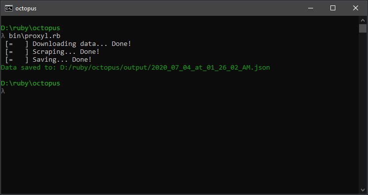

# Proxyl 🌐

Proxyl is a scraper that scrapes free proxy server information from [Free Proxy List](https://free-proxy-list.net) and saves it in `json` format.
Proxyl is built using [http](https://rubygems.org/gems/http) and [Nokogiri](https://rubygems.org/gems/nokogiri).

* [Usage](#usage)
* [Testing](#testing)

## Usage

Clone...install dependencies...run

```bash
git clone https://github.com/aldemeery/proxyl.git
cd proxyl
bundle install
bin/proxyl.rb
```



The scraper should start scraping and in few seconds you should have your json file location printed on your screen.
The json follows the following format:

```json
[
    {
        "ip": "139.255.101.244",
        "port" :"38041",
        "code": "ID",
        "country": "Indonesia",
        "anonymity": "elite proxy",
        "https": true
    }
]
```

---

## Testing

The scraper is fully tested with [RSpec](https://rspec.info/), to run the tests:

```bash
rspec .
```

---

## Contributers

👤 **Osama Aldemeery**

- Github: [@aldemeery](https://github.com/aldemeery)
- Linkedin: [osamaaldemeery](https://linkedin.com/in/osamaaldemeery)

---

## Contributing

Bug reports and pull requests are welcome on GitHub at https://github.com/aldemeery/proxyl


---

## License

Proxyl is available as open source under the terms of the [MIT License](https://opensource.org/licenses/MIT).

